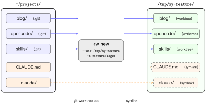

# aw — git worktree for polyrepos

Lightweight CLI that creates isolated workspaces across multiple repositories using git worktrees, with automatic AI context file linking.

## Why

In polyrepo setups, creating a feature branch means running `git worktree add` in every repo, one by one. `aw` does it in one command — scan all repos, create worktrees on the same branch, and symlink AI context files (CLAUDE.md, .cursor/, etc.) automatically.



## Install

```bash
go install github.com/lldxflwb/aw@latest
```

Or build from source:

```bash
git clone https://github.com/lldxflwb/aw.git
cd aw && go build -o aw .
```

## Usage

### `aw new` — Create a workspace

```bash
# From a directory containing multiple git repos:
cd ~/projects
aw new --dir /tmp/my-feature -b feature/login
```

This will:
1. Scan for all git repos in the current directory
2. Create a git worktree for each repo with the given branch
3. Symlink workspace-level AI context files (CLAUDE.md, .claude/, etc.)
4. Symlink repo-level untracked AI context files
5. Write state to `.aw/workspace.json`

Use `-j` (or `--jump`) to enter the workspace after creation:

```bash
aw new --dir /tmp/my-feature -b feature/login -j
```

This spawns a new shell in the workspace directory. Type `exit` to return to the original location.

### `aw status` — Show workspace status

```bash
cd /tmp/my-feature
aw status
```

```
REPO      BRANCH         STATUS  AHEAD  BEHIND  LAST COMMIT
--------  -------------  ------  -----  ------  ---------------------------
backend   feature/login  2M      1      0       a1b2c3d Add auth endpoint
frontend  feature/login  clean   0      0       e4f5g6h Update login page
```

Options: `--short` for tab-separated output, `--json` for machine-readable output.

### `aw rm` — Remove a workspace

```bash
cd /tmp/my-feature
aw rm --force --branch
```

This will:
1. Check for dirty repos (fails without `--force`)
2. Remove symlinks
3. Remove git worktrees
4. Optionally delete branches (`--branch`, uses `-D` with `--force`)
5. Clean up `.aw/` directory

Options: `--dry-run` to preview without executing.

### `aw relink` — Fix copy-based context links

On Windows without Developer Mode, symlinks fail and `aw new` falls back to copying files. After enabling Developer Mode (Settings → System → For developers), run:

```bash
aw relink
```

This converts all copy-based context links back to proper symlinks and updates `.aw/workspace.json`.

## Flags (all commands)

| Flag | Description |
|------|-------------|
| `--json` | JSON-only stdout, logs to stderr |
| `--dir <path>` | Explicit workspace directory |

## JSON protocol

All `--json` output follows this envelope:

```json
{
  "schema_version": 1,
  "ok": true,
  "data": { ... },
  "error": null,
  "warnings": []
}
```

Exit codes: `0` success, `1` partial failure, `2` usage error.

## AI context files

`aw` automatically discovers and symlinks these files/directories:

- `CLAUDE.md`, `AGENTS.md`, `codex.md`
- `.claude/`, `.codex/`, `.cursor/`, `.cursorrules`
- `aw.yml`

Workspace-level files are linked to the workspace root. Repo-level files are linked only if they are **untracked** by git (tracked files already exist in the worktree).

## License

MIT
